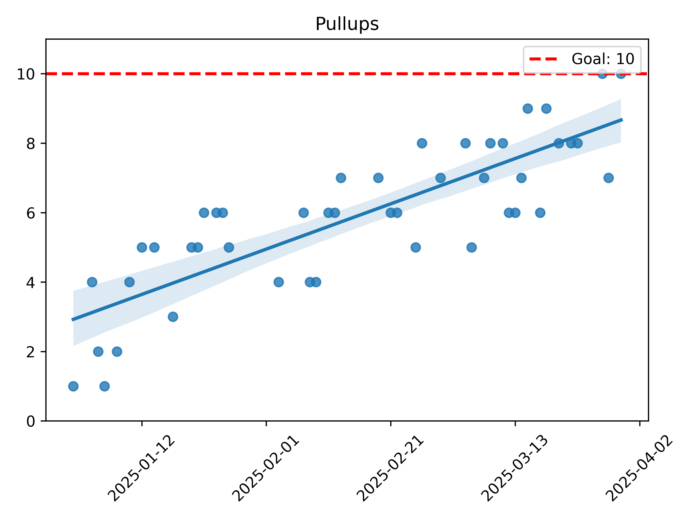
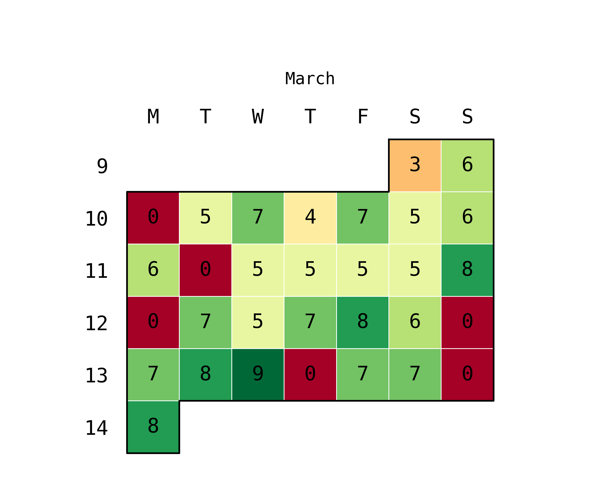
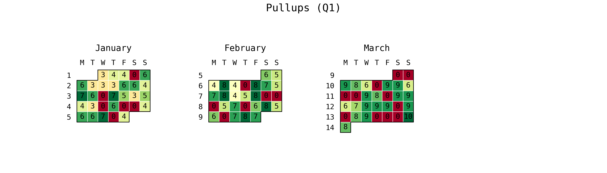
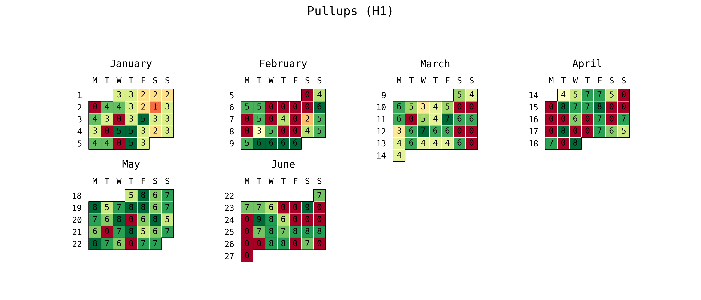
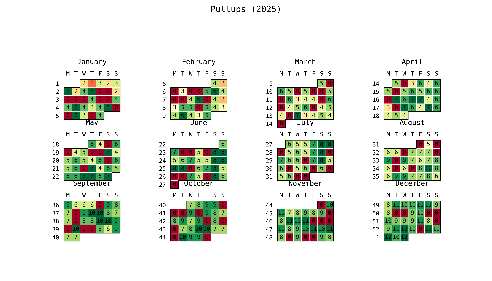
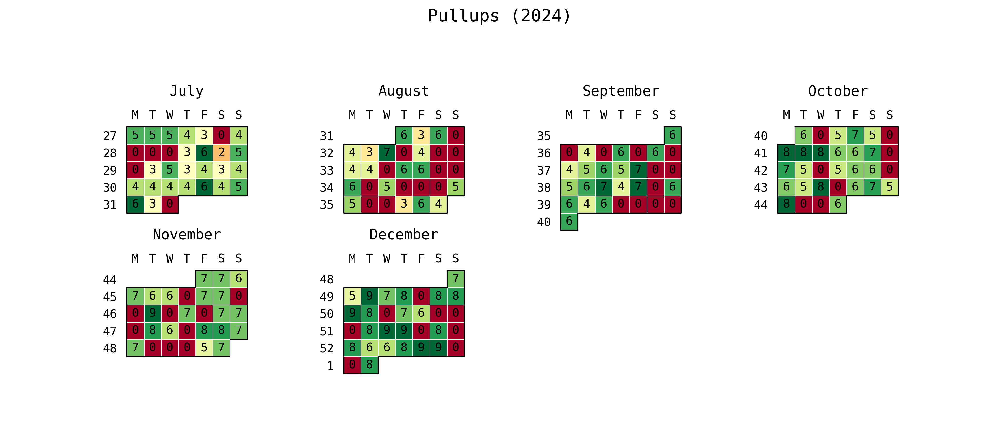
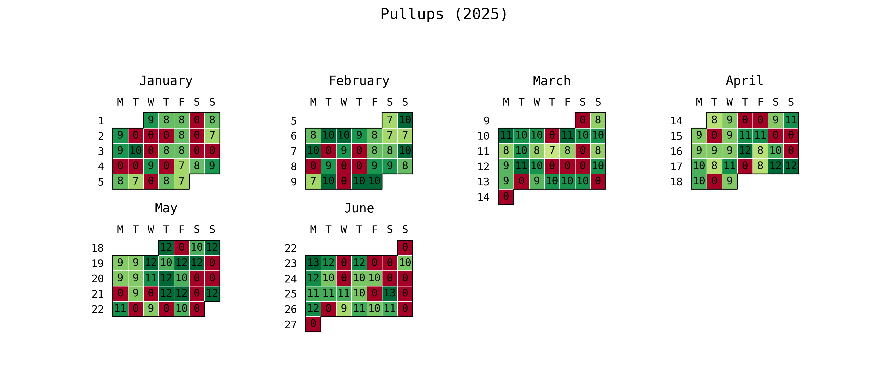
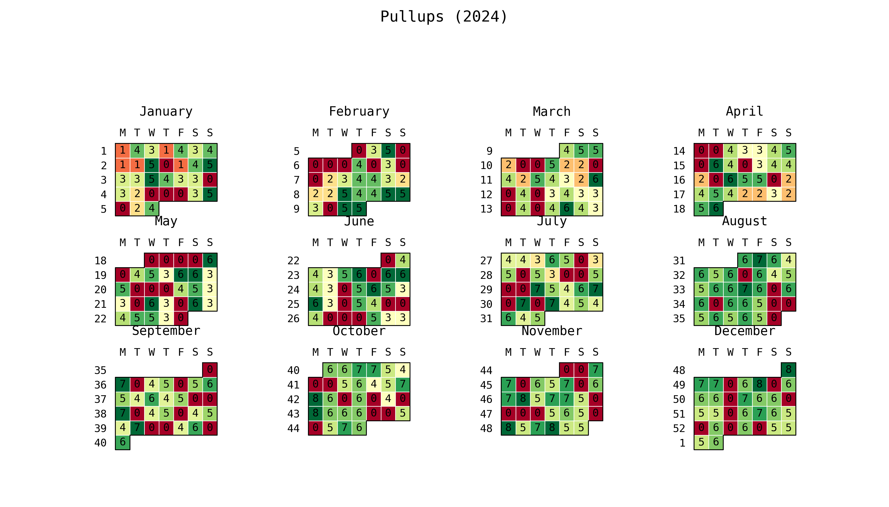
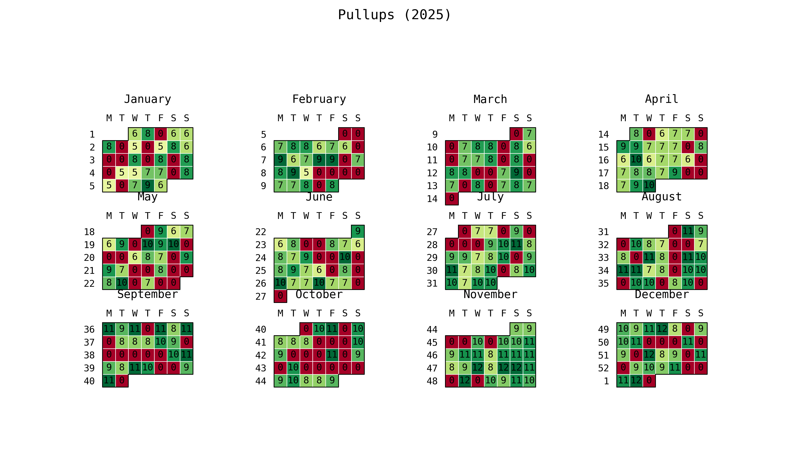

# Scattercal

Opinionated metric visualization: scatter plots with trendlines and calendar heatmaps, from simple date/value data.

## Why not just use seaborn / july directly?

Both are great libraries, but every time you want a "quick metric plot" you end up writing the same 30-40 lines of boilerplate:

- Sort and filter points by date range
- Configure matplotlib backends and DPI
- Format x-axis dates
- Add a goal line with legend
- Scale y-axis to fit both data and goal
- Split multi-year data into per-year calendar heatmaps
- Choose month-plot vs calendar-plot based on data span
- Serialize figures to PNG bytes and clean up

Scattercal wraps all of that into two functions (`trend_plot` and `calendar_heatmap`) that accept plain lists of dates and values.

## Install

```bash
pip install matplotlib seaborn july
```

## API

### `trend_plot(dates, values, *, title="", goal=None, start=None, end=None) -> bytes`

Scatter plot with regression trendline. Returns PNG bytes.

### `calendar_heatmap(dates, values, *, title="", start=None, end=None) -> list[tuple[str, bytes]]`

Calendar heatmap. Returns a list of `(label, png_bytes)` tuples. Automatically picks the right layout:
- 1 month of data: month plot
- 1 year: single calendar
- Multiple years: one calendar per year

## Examples

### Scatter plot with trendline and goal

```python
from datetime import datetime, timedelta
from plotter import trend_plot
import random

random.seed(42)
dates = [datetime(2025, 1, 1) + timedelta(days=d*3) for d in range(30)
         if random.random() > 0.3]
values = [3 + i * 0.4 + random.uniform(-2, 2) for i in range(len(dates))]

png = trend_plot(dates, values, title="Pullups", goal=10)
```



### 1-month heatmap

```python
from datetime import datetime
from plotter import calendar_heatmap
import random

random.seed(7)
dates = [datetime(2025, 3, d) for d in range(1, 32) if random.random() > 0.2]
values = [random.randint(2, 8) for _ in dates]

images = calendar_heatmap(dates, values, title="Pullups (March)")
```



### 3-month heatmap

```python
from datetime import datetime, timedelta
from plotter import calendar_heatmap
import random

random.seed(7)
base = datetime(2025, 1, 1)
dates = [base + timedelta(days=d) for d in range(90) if random.random() > 0.25]
values = [random.randint(2, 10) for _ in dates]

images = calendar_heatmap(dates, values, title="Pullups (Q1)")
```



### 6-month heatmap

```python
from datetime import datetime, timedelta
from plotter import calendar_heatmap
import random

random.seed(7)
base = datetime(2025, 1, 1)
dates = [base + timedelta(days=d) for d in range(180) if random.random() > 0.25]
values = [random.randint(1, 12) for _ in dates]

images = calendar_heatmap(dates, values, title="Pullups (H1)")
```



### 12-month heatmap

```python
from datetime import datetime, timedelta
from plotter import calendar_heatmap
import random

random.seed(7)
base = datetime(2025, 1, 1)
dates = [base + timedelta(days=d) for d in range(365) if random.random() > 0.3]
values = [random.randint(1, 15) for _ in dates]

images = calendar_heatmap(dates, values, title="Pullups (2025)")
# Returns 1 image (single year)
```



### 12-month heatmap starting mid-year (auto-splits by calendar year)

When your 12-month window crosses a year boundary (e.g. Jul 2024 - Jun 2025), Scattercal automatically splits into one calendar per year:

```python
from datetime import datetime, timedelta
from plotter import calendar_heatmap
import random

random.seed(7)
base = datetime(2024, 7, 1)
dates = [base + timedelta(days=d) for d in range(365) if random.random() > 0.3]
values = [random.randint(2, 12) for _ in dates]

images = calendar_heatmap(dates, values, title="Pullups")
# Returns 2 images: "Pullups (2024)" and "Pullups (2025)"
```




### 24-month heatmap (auto-splits by year)

```python
from datetime import datetime, timedelta
from plotter import calendar_heatmap
import random

random.seed(7)
base = datetime(2024, 1, 1)
dates = [base + timedelta(days=d) for d in range(730) if random.random() > 0.3]
values = [random.randint(1, 15) for _ in dates]

images = calendar_heatmap(dates, values, title="Pullups")
# Returns 2 tuples: ("Pullups (2024)", bytes), ("Pullups (2025)", bytes)
```




## CLI

```bash
python plotter.py data.json --outdir out
```

JSON shape:

```json
{
  "title": "Pullups",
  "goal": 10,
  "start": "2025-01-01",
  "end": "2025-12-31",
  "points": [
    {"date": "2025-01-01T12:00:00", "value": 3},
    {"date": "2025-01-02T12:00:00", "value": 4}
  ]
}
```

Only `points` is required. `title`, `goal`, `start`, and `end` are optional.
